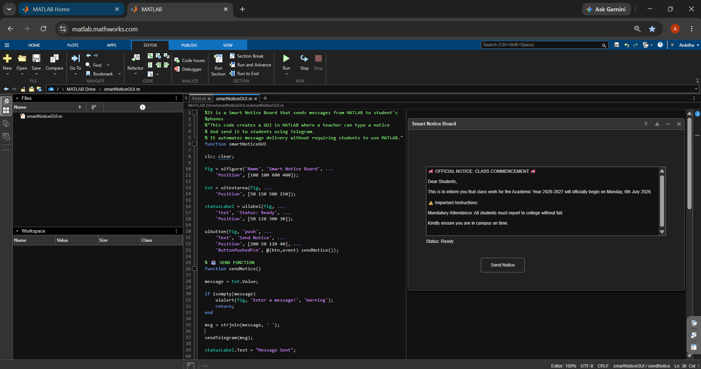
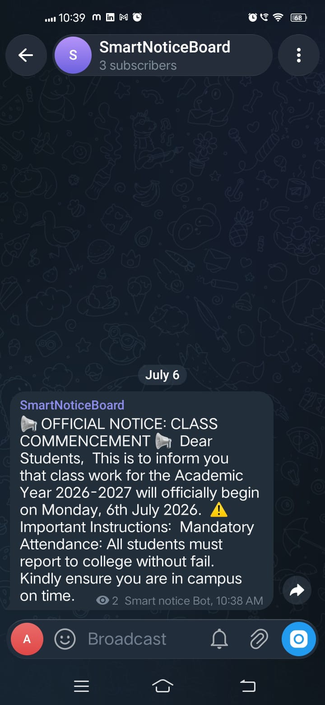

# Smart Notice Board using MATLAB and Telegram

<p align="center">
  
</p>

A Smart Notice Board developed using **MATLAB** and the **Telegram Bot API** to broadcast notices directly to students through Telegram. This project demonstrates how MATLAB can communicate with web services to automate message delivery.

---

## Project Overview

The Smart Notice Board provides a simple graphical interface where a teacher can type a notice and instantly send it to students via Telegram. Instead of checking physical notice boards, students receive notifications directly on their phones.

This project integrates a MATLAB-based graphical user interface with the Telegram Bot API to deliver real-time notifications. It demonstrates GUI development, API integration, and communication concepts relevant to embedded systems and IoT applications.

---

## Features

- MATLAB-based Graphical User Interface (GUI)
- Send notices with a single click
- Real-time Telegram notifications
- Beginner-friendly implementation
- Demonstrates HTTP API communication using MATLAB

---

## Technologies Used

- MATLAB
- MATLAB GUI (`uifigure`)
- Telegram Bot API
- HTTP Requests (`webwrite`)
- JSON

---

## Project Workflow

```
Teacher
   │
   ▼
MATLAB GUI
   │
   ▼
Telegram Bot API
   │
   ▼
Telegram Channel/User
   │
   ▼
Students
```

---


## File Structure

```text
Smart-Notice-Board-MATLAB/
│
├── smartNoticeGUI.m          # Main MATLAB GUI
├── sendTelegramMessage.m     # Sends notices via Telegram Bot API
├── testTelegram.m            # Test script for Telegram API
├── README.md
├── smartnoticeboard_gui.png  # MATLAB GUI screenshot
├── sendTelegramMsg.png       # Sending process screenshot
├── telegram_output.jpeg      # Telegram notification screenshot
└── Telegram_botfather.jpeg   # Bot creation/configuration screenshot
```

---

## How It Works

1. Open the MATLAB GUI.
2. Type the notice.
3. Click **Send Notice**.
4. MATLAB sends an HTTP POST request to the Telegram Bot API.
5. The bot delivers the notice to the configured Telegram channel or user.

---

## Screenshots

### MATLAB GUI

<p align="center">
  
</p>

---

### Telegram Notification Received

<p align="center">
  
</p>

---

## Requirements

- MATLAB R2020a or later
- Internet connection
- Telegram account
- Telegram Bot Token

---

## Configuration

Before running the project, update the following values in `sendTelegramMessage.m`:

```matlab
botToken = 'YOUR_BOT_TOKEN';
chatID   = 'YOUR_CHAT_ID';
```

### Setup Steps

1. Create a Telegram Bot using **@BotFather**.
2. Copy your Bot Token.
3. Replace `YOUR_BOT_TOKEN`.
4. Replace `YOUR_CHAT_ID` with your Telegram Channel/User ID.

> **Note:** Never upload your real Bot Token or Chat ID to a public GitHub repository.

---

## Future Enhancements

- User authentication for teachers
- Schedule notices
- Send images and PDF documents
- Store notices in a database
- Notification history
- Multi-class notice management
- Email and SMS integration

---

## Learning Outcomes

This project helped in understanding:

- MATLAB GUI development
- Telegram Bot API integration
- HTTP requests using `webwrite`
- JSON data exchange
- Real-time communication systems

---

## Author

**Ankitha Thammali**

B.Tech – Electronics and Communication Engineering (ECE)

Feel free to fork this repository, open issues, or submit pull requests for improvements.

---
